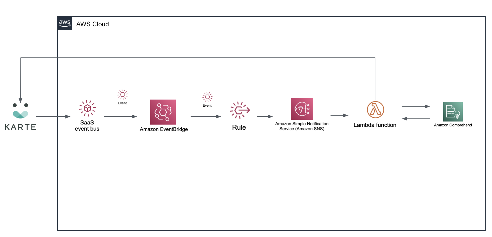

# eventbridge-integration-plaid-karte-comprehend
## Amazon EventBridge Integration Solution: Reaching out to online end users with KARTE Talk and Amazon Comprehend

This Quick Start deploys an integration with Amazon Comprehend, AWS Lambda and AWS SNS for Amazon EventBridge SaaS Partner Integrations with PLAID. 

With this solution, chat messages sent to KARTE are analyzed for sentiment & key phrase extraction using Amazon Comprehend. Optimal messages can be sent based on the analysis results.

To post feedback, submit feature ideas, or report bugs, use the Issues section of [this GitHub repo](https://github.com/aws-quickstart/eventbridge-integration-plaid-karte-comprehend).

