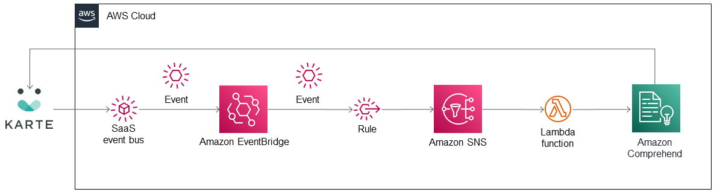

## PLAID KARTE Comprehend EventBridge integration

This Amazon EventBridge integration combines the PLAID KARTE software as a service (SaaS) with Amazon Comprehend, Amazon Web Services (AWS) Lambda, and Amazon EventBridge to analyze sentiment and extract key phrases from chat messages to update KARTE user data.

KARTE sends events that include the chat message body and the ID of the user who sent the chat. The chat message is then used by Amazon Comprehend to analyze sentiment and extract key phrases in real time.  As KARTE is an event-driven system, you can use the information to perform various actions on users in real time when the KARTE user data is updated. 

To post feedback, submit feature ideas, or report bugs, use the Issues section of [this GitHub repo](https://github.com/aws-quickstart/eventbridge-integration-plaid-karte-comprehend).

